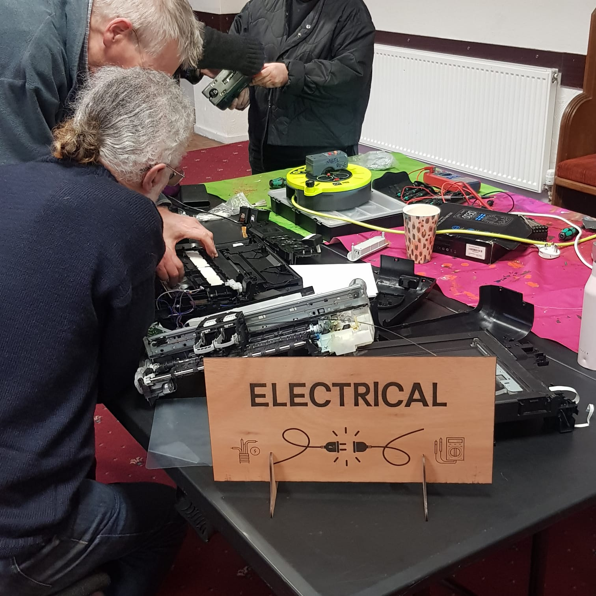
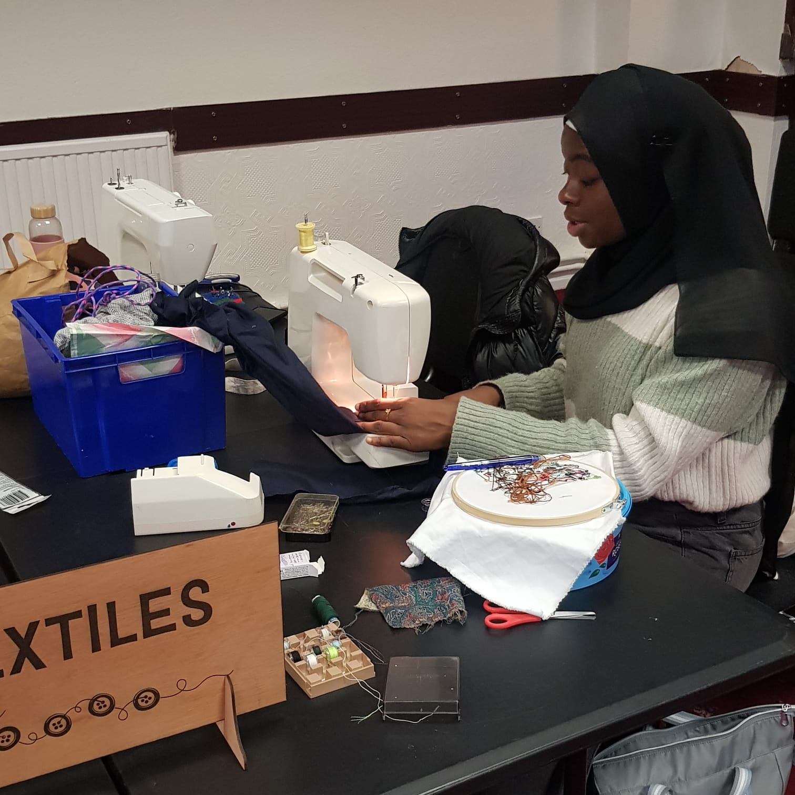
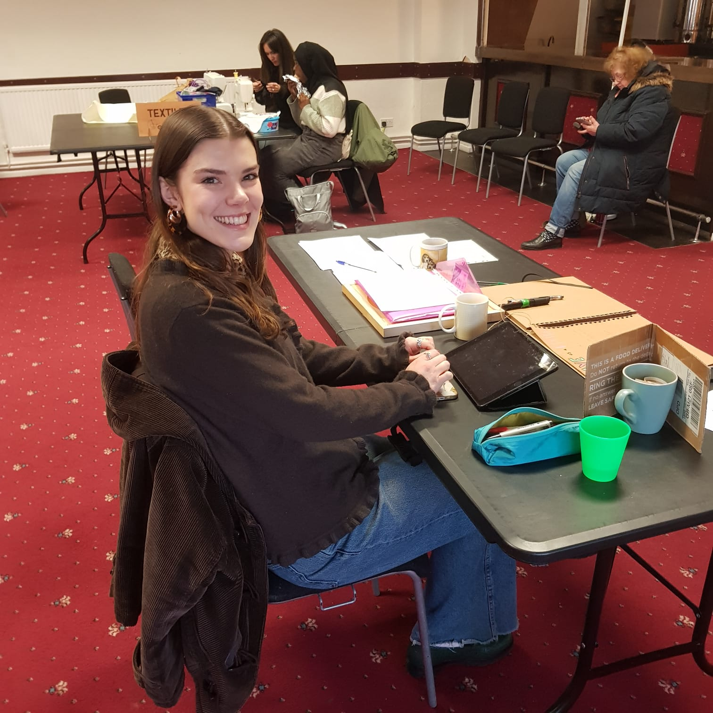

# Chorlton Repair Cafe 

  <a href="mailto:chorltonrepaircafe@gmail.com" style="display: inline-flex; align-items: center; gap: 10px; padding: 10px 14px; border: 2px solid #1f7a3a; border-radius: 999px; background: #f3fff6; color: #114d25; font-weight: 700; text-decoration: none;">
    
    Email us
  </a>
  <a href="https://www.facebook.com/ChorltonRepairCafe" style="display: inline-flex; align-items: center; gap: 10px; padding: 10px 14px; border: 2px solid #1f7a3a; border-radius: 999px; background: #f3fff6; color: #114d25; font-weight: 700; text-decoration: none;">
    
    Facebook
  </a>
  <a href="https://www.instagram.com/ChorltonRepairCafe" style="display: inline-flex; align-items: center; gap: 10px; padding: 10px 14px; border: 2px solid #1f7a3a; border-radius: 999px; background: #f3fff6; color: #114d25; font-weight: 700; text-decoration: none;">
    
    Instagram
  </a>
  <a href="https://wa.me/447362928476" style="display: inline-flex; align-items: center; gap: 10px; padding: 10px 14px; border: 2px solid #1f7a3a; border-radius: 999px; background: #f3fff6; color: #114d25; font-weight: 700; text-decoration: none;">
    
    WhatsApp 
  </a>
  <a href="https://paymentrequest.natwestpayit.com/reusable-links/79608064-8a6c-4b47-a53e-e59e9ba4d0a2" style="display: inline-flex; align-items: center; gap: 10px; padding: 10px 14px; border: 2px solid #1f7a3a; border-radius: 999px; background: #f3fff6; color: #114d25; font-weight: 700; text-decoration: none;">
    
    Donate
  </a>

## What is a repair cafe
A Repair Café is a friendly community space where people come together to fix broken items instead of throwing them away. Whether it's a small appliance, a piece of clothing, or a gadget, our volunteer repair experts can help you bring it back to life. Enjoy a cup of coffee, learn new skills, and help reduce waste—all for free!

Our repair cafe runs from 10-12 every second Saturday of the month.  
We are at [St Margaret's Community Centre, Brantingham Road, Chorlton, M21 0TT](https://maps.app.goo.gl/MsfsG1fik2Hui1vv7)

Dates for upcoming cafes:  
Sat 13th June  
Sat 11th July  
Sat 8th August  
Sat 12th September  
Sat 10th October  

## Photos from our repair cafe
Here are some photos from our recent repair cafe sessions:

  
  
  

## Volunteer Area
A section of useful links for volunteers  
[Request equipment](https://docs.google.com/forms/d/e/1FAIpQLSf2jHupj9Mkbn7sAeEWeVpSFq8k2gEWA8VpugQOtgPU2unvUA/viewform?usp=dialog)  
[Sign out repair](https://docs.google.com/forms/d/e/1FAIpQLSdtTokbJxfZ_nQXuE32kcNeX8_-BXOmixyYRvb2rqa4V6uxtg/viewform?usp=dialog)  

Icons are from : https://dashboardicons.com
